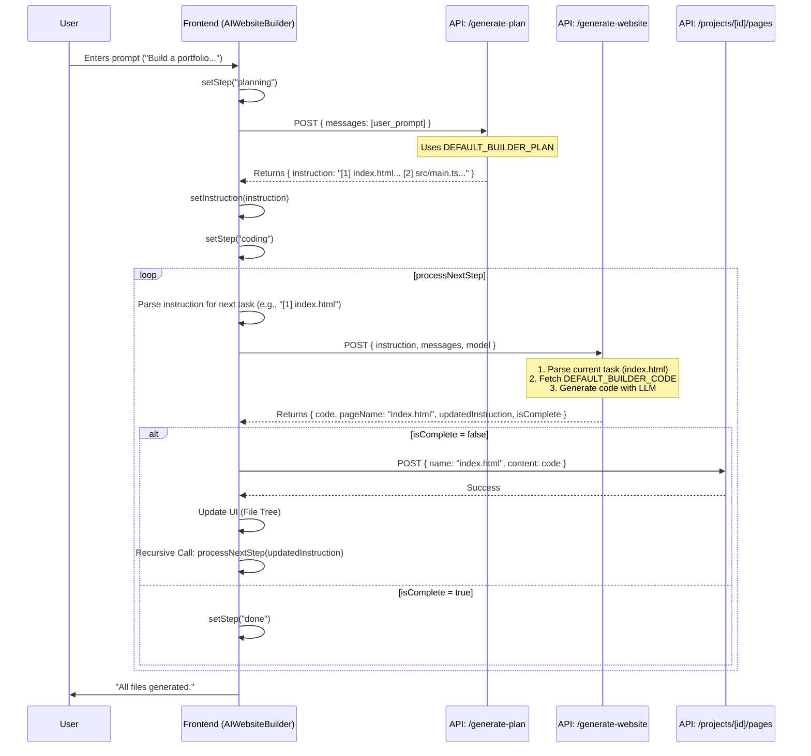

# AI Website Generation Plan & Architecture

This document describes the architectural flow for the "AI Website Builder" feature, which generates a full Vite + TypeScript project structure based on user prompts.

## Overview

The system uses a recursive "Plan-then-Execute" loop:
1.  **Planning Phase**: The AI analyzes the user request and generates a step-by-step list of files to create (e.g., `[1] index.html`, `[2] src/main.ts`).
2.  **Execution Loop**: The frontend iterates through this list, requesting the content for one file at a time from the AI.
3.  **State Management**: As each file is generated, the instruction list is updated (marking steps as `[Done]`), and the loop continues until all files are created.

## Key Components

| Component | Path | Description |
| :--- | :--- | :--- |
| **Frontend Builder** | `components/ai-website-builder.tsx` | React component that manages the chat UI, visualization, and the generation loop (`processNextStep`). |
| **Plan API** | `app/api/ai/generate-plan/route.ts` | Generates the initial file list (instruction set) using `gemini-2.0-flash`. |
| **Generation API** | `app/api/ai/generate-website/route.ts` | Generates the actual code for a single file based on the current instruction. |
| **Prompts** | `lib/ai-prompts.ts` | Contains the system prompts (`DEFAULT_BUILDER_PLAN`, `DEFAULT_BUILDER_CODE`) used by the APIs. |
| **Memory** | `lib/ai-memory.ts` | Helper to parse instructions and format "short-term memory" (list of already generated files). |

## Execution Flow (Sequence Diagram)

## Detailed Step-by-Step Description

### 1. Planning Phase (`startGeneration`)
- **Trigger**: User sends a message in `AIWebsiteBuilder`.
- **Action**: Frontend calls `POST /api/ai/generate-plan`.
- **Backend Logic**:
    - Receives conversation history.
    - Uses `DEFAULT_BUILDER_PLAN` system prompt.
    - Asks the LLM to output a list of files in a strict format: `[N] filename : [usedfor]description[usedfor]`.
- **Result**: A string containing the execution plan (e.g., `[1] index.html...`).

### 2. Execution Loop (`processNextStep`)
- **Trigger**: Immediately after receiving the plan.
- **Logic**:
    - The function checks the `instruction` string for the first task that is NOT marked as `[Done]`.
    - It extracts the filename (e.g., `index.html`).
    - It calls `POST /api/ai/generate-website`.

### 3. File Generation (`/api/ai/generate-website`)
- **Backend Logic**:
    - Parses the instruction to confirm the target file.
    - Fetches `DEFAULT_BUILDER_CODE` from `lib/ai-prompts.ts`.
    - Injects context:
        - `FILE_STRUCTURE` (from `lib/ai-memory.ts`).
        - `shortTermMemory` (list of previously generated files).
        - Specific rules for the file type (HTML vs TS vs CSS).
    - Calls the LLM (Gemini or DeepSeek).
    - **Parsing**: robustly extracts code from `[code]` blocks or Markdown code fences.
    - **Instruction Update**: Replaces `[N]` with `[Done]` in the instruction string.
- **Response**: Returns the generated code, the filename, and the *updated* instruction string.

### 4. Storage & Recursion
- **Frontend Action**:
    - Saves the file to MongoDB via `POST /api/projects/[id]/pages`.
    - Updates the visual File Tree.
    - recursively calls `processNextStep` with the *new* instruction string (where step 1 is now `[Done]`).
- **Termination**: The loop continues until the backend returns `isComplete: true` (no more numbered tasks found).
